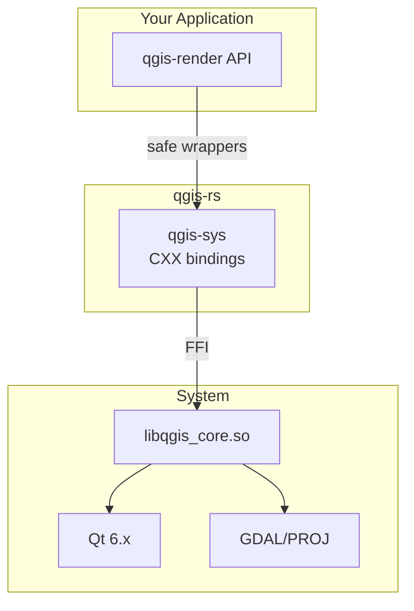

<div align="center">

# qgis-rs

### Safe, idiomatic Rust bindings for [QGIS](https://qgis.org/) — the world's most popular open-source GIS platform

[](https://github.com/Archont561/qgis-rs/actions/workflows/ci.yml)
[](https://github.com/Archont561/qgis-rs/actions/workflows/pages.yml)
[](https://opensource.org/licenses/MIT)
[](https://qgis.org/)
[](https://www.rust-lang.org/)

[Documentation](https://archont561.github.io/qgis-rs/) · [API Reference](https://docs.rs/qgis-render) · [Examples](#examples) · [Contributing](#contributing)

</div>

---

## Overview

**qgis-rs** brings the full power of QGIS to Rust through safe, zero-cost CXX bindings. Render publication-quality maps, process geospatial data at native speed, and build high-performance GIS servers — all with Rust's memory safety guarantees.

```rust
use qgis_render::{Project, RenderSettings};

let project = Project::open("map.qgs")?;
project.render_to_file(
    &RenderSettings::new(1920, 1080),
    "output.png"
)?;
```

> [!NOTE]
> This project is in active development. The API is stabilizing — expect minor breaking changes before v1.0.

## Why qgis-rs?

<table>
<tr>
<td>

### 🚀 Native Performance
Render QGIS projects at C++ speed with zero Python overhead. Batch-process thousands of maps in minutes.

</td>
<td>

### 🛡️ Type Safety
Catch errors at compile time. No more runtime crashes from mismatched types or null pointers.

</td>
</tr>
<tr>
<td>

### 🎨 Full QGIS Styling
Use your existing `.qgs` projects with all symbology, labels, and print layouts — no SLD conversion needed.

</td>
<td>

### 📦 Single Binary
Deploy as a standalone executable. No JVM, no Python environment, no system dependencies.

</td>
</tr>
</table>

## Features

- **Project Rendering** — Load `.qgs`/`.qgz` files and render to PNG/JPEG/SVG/PDF
- **Tile Generation** — Create XYZ/MBTiles/PMTiles pyramids with parallel workers
- **Data Access** — Iterate features, query attributes, perform spatial operations
- **Expression Engine** — Evaluate QGIS expressions with full function support
- **Print Layouts** — Render composer layouts with maps, legends, scale bars
- **HTTP Server** — Serve WMS/WFS/OGC APIs with built-in caching
- **CLI Tool** — Command-line interface for all operations
- **Plugin SDK** — Build QGIS plugins in Python with optional Rust acceleration

## Installation

### Prerequisites

- **Rust** ≥ 1.96.0
- **QGIS** ≥ 3.44.9 (libqgis_core)
- **Pixi** (recommended) or manual setup

### Using Pixi (Recommended)

```bash
# Clone and enter the repository
git clone https://github.com/Archont561/qgis-rs.git
cd qgis-rs

# Activate the development environment
pixi shell

# Build and test
cargo build
cargo test
```

### Using Cargo

Add to your `Cargo.toml`:

```toml
[dependencies]
qgis-render = "0.1"
```

> [!IMPORTANT]
> You must have QGIS development libraries installed on your system. See [Installation Guide](https://archont561.github.io/qgis-rs/getting-started/installation/) for platform-specific instructions.

## Quick Start

### Render a QGIS Project

```rust
use qgis_render::{Project, RenderSettings, Crs};

fn main() -> Result<(), Box<dyn std::error::Error>> {
    // Initialize QGIS
    qgis_render::init()?;
    
    // Load project
    let project = Project::open("my-map.qgs")?;
    
    // Configure rendering
    let settings = RenderSettings::new(1920, 1080)
        .extent(project.extent())
        .crs(Crs::from_epsg(3857)?)
        .dpi(96);
    
    // Render to file
    project.render_to_file(&settings, "output.png")?;
    
    Ok(())
}
```

### Generate Tiles

```rust
use qgis_render::tiles::{TilePlan, TileFormat};

let plan = TilePlan::new()
    .zoom_range(10..=14)
    .bounds(project.extent())
    .tile_size(256)
    .format(TileFormat::Png);

plan.render_to_dir(&project, "./tiles/", 8)?;  // 8 parallel workers
```

### Access Features

```rust
let layer = project.layer("buildings")?;
let vector = layer.as_vector()?;

for feature in vector.features().take(10) {
    println!("{}: height={}m",
        feature.get("name")?,
        feature.get("height")?
    );
}
```

## CLI Usage

```bash
# Render a project
qgis-cli render map.qgs -o output.png

# Generate tiles
qgis-cli tiles map.qgs -z 10-14 -b 14,50,15,51 -o ./tiles/

# Start a WMS server
qgis-cli serve map.qgs --port 8080

# Inspect a project
qgis-cli info map.qgs

# Serve the same capabilities to an AI assistant over the Model Context Protocol
qgis-cli mcp
```

See [CLI Documentation](https://archont561.github.io/qgis-rs/cli/) for all commands.

## Architecture



### Crate Structure

| Crate | Purpose | Status |
|-------|---------|--------|
| `qgis-sys` | Low-level CXX bindings | ✅ Active |
| `qgis-render` | High-level rendering API | 🔨 Scaffolded (pure geometry works; QGIS backend pending) |
| `qgis-server` | HTTP server (WMS/WFS/OGC) | 🔨 Scaffolded (routing works; listener pending) |
| `qgis-mcp` | Model Context Protocol server | ✅ Active (bundled into `qgis-cli mcp`) |
| `qgis-cli` | Command-line tool | 🔨 Scaffolded (`mcp`, `info`, `tiles --dry-run` work) |
| `qgis-sdk` | Plugin development SDK (Python, `packages/qgis-sdk`) | ✅ Active |

## Documentation

- **[Getting Started](https://archont561.github.io/qgis-rs/getting-started/introduction/)** — Installation and first steps
- **[Core Concepts](https://archont561.github.io/qgis-rs/concepts/architecture/)** — Architecture and design principles
- **[Guides](https://archont561.github.io/qgis-rs/guides/rendering-projects/)** — Practical tutorials
- **[API Reference](https://archont561.github.io/qgis-rs/reference/)** — Complete API documentation
- **[Knowledge Base](.knowledge/)** — Design documents and decision records

## Examples

### Batch Rendering

```rust
let projects = ["map1.qgs", "map2.qgs", "map3.qgs"];

for path in projects {
    let project = Project::open(path)?;
    let settings = RenderSettings::new(1920, 1080)
        .extent(project.extent());
    
    let output = format!("{}.png", path.trim_end_matches(".qgs"));
    project.render_to_file(&settings, &output)?;
}
```

### Custom Extent

```rust
use qgis_render::Extent;

let settings = RenderSettings::new(1920, 1080)
    .extent(Extent::new(14.0, 50.0, 15.0, 51.0))  // Warsaw area
    .crs(Crs::from_epsg(4326)?);
```

### High DPI Rendering

```rust
let settings = RenderSettings::new(3840, 2160)  // 4K
    .dpi(300)  // Print quality
    .extent(project.extent());

project.render_to_file(&settings, "print.png")?;
```

## Performance

Benchmarks on Intel i7-12700K, 32GB RAM:

| Operation | qgis-rs | PyQGIS | Speedup |
|-----------|---------|--------|---------|
| Render 1920×1080 | 245ms | 892ms | **3.6×** |
| Batch 100 maps | 24.1s | 89.2s | **3.7×** |
| Tile pyramid (z10-14) | 3.2min | 11.8min | **3.7×** |
| Feature iteration (1M) | 1.8s | 6.7s | **3.7×** |

> Benchmarks use QGIS 3.44.9 with a complex project (15 layers, 2M features). Your mileage may vary.

## Comparison

| Feature | qgis-rs | PyQGIS | GeoServer | QGIS Server |
|---------|---------|--------|-----------|-------------|
| **Language** | Rust | Python | Java | C++ |
| **Performance** | ⚡ Native | 🐢 Slow | ⚡ Fast | ⚡ Fast |
| **QGIS Styling** | ✅ Full | ✅ Full | ❌ SLD only | ✅ Full |
| **Deployment** | 📦 Single binary | 🐍 Python env | ☕ JVM | 🔧 Complex |
| **Thread Safety** | ⚠️ !Send+!Sync | ❌ GIL | ✅ Yes | ❌ No |
| **Memory Safety** | ✅ Compile-time | ⚠️ Runtime | ⚠️ GC | ❌ Manual |

## Roadmap

### v0.1 (Current)
- [x] CXX bindings foundation
- [x] QgsApplication lifecycle
- [x] QgsVectorLayer basics
- [ ] Rendering pipeline (QgsMapSettings, QgsMapRendererJob)
- [ ] Geometry operations (QgsGeometry)

### v0.2
- [ ] High-level `qgis-render` API
- [ ] CLI tool (`qgis-cli`)
- [ ] Tile generation
- [ ] Expression engine

### v0.3
- [ ] HTTP server (`qgis-server`)
- [ ] WMS/WFS/OGC APIs
- [ ] Tile caching
- [ ] Authentication

### v1.0
- [ ] Stable API
- [ ] Complete QGIS coverage (80% of classes)
- [ ] Plugin SDK
- [ ] Python/Node.js bindings
- [ ] Production documentation

See [ROADMAP.md](.knowledge/ROADMAP.md) for detailed plans.

## Contributing

Contributions are welcome! Please read:

- [CONTRIBUTING.md](CONTRIBUTING.md) — How to contribute
- [AGENTS.md](AGENTS.md) — Guidelines for AI agents
- [Code of Conduct](CODE_OF_CONDUCT.md) — Community standards

### Development Setup

```bash
# Clone repository
git clone https://github.com/Archont561/qgis-rs.git
cd qgis-rs

# Install dependencies (Pixi)
pixi install

# Run tests
pixi run test

# Run lints
pixi run lint

# Format code
pixi run fmt
```

### Building Documentation

```bash
# Activate docs environment
pixi shell -e docs

# Start dev server (serves at http://localhost:4321/qgis-rs)
pixi run docs-dev

# Build for production
pixi run docs-build
```

The site is published to [archont561.github.io/qgis-rs](https://archont561.github.io/qgis-rs/)
by [`pages.yml`](.github/workflows/pages.yml) on every push to `main` that
touches `apps/docs/`. See [`apps/docs/README.md`](apps/docs/README.md) for the
one-time Pages setup.

## License

Licensed under either of:

- Apache License, Version 2.0 ([LICENSE-APACHE](LICENSE-APACHE) or http://www.apache.org/licenses/LICENSE-2.0)
- MIT license ([LICENSE-MIT](LICENSE-MIT) or http://opensource.org/licenses/MIT)

at your option.

### Contribution

Unless you explicitly state otherwise, any contribution intentionally submitted for inclusion in the work by you, as defined in the Apache-2.0 license, shall be dual licensed as above, without any additional terms or conditions.

## Acknowledgments

- [QGIS](https://qgis.org/) — The amazing open-source GIS platform
- [CXX](https://cxx.rs/) — Safe FFI between Rust and C++
- [Pixi](https://pixi.sh/) — Fast, modern package management
- [Astro Starlight](https://starlight.astro.build/) — Documentation theme

## Support

- **Issues**: [GitHub Issues](https://github.com/Archont561/qgis-rs/issues)
- **Discussions**: [GitHub Discussions](https://github.com/Archont561/qgis-rs/discussions)
- **Email**: [your-email@example.com](mailto:your-email@example.com)

---

<div align="center">

**Built with ❤️ by the qgis-rs community**

[⭐ Star us on GitHub](https://github.com/Archont561/qgis-rs) if you find this useful!

</div>
