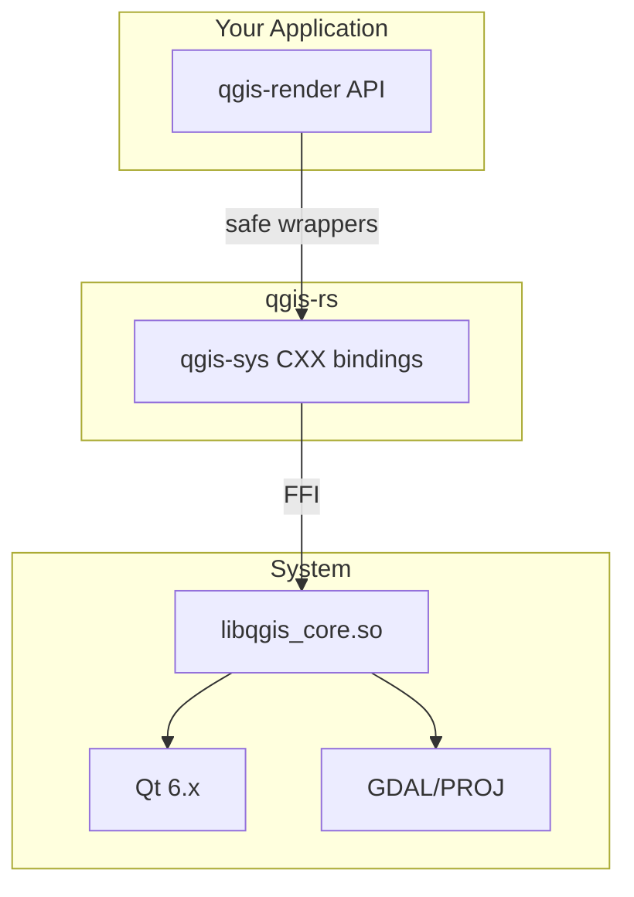

# qgis-rs

<p align="center">
  <strong>Safe, idiomatic Rust bindings for <a href="https://qgis.org/">QGIS</a> — the world's most popular open-source GIS platform.</strong><br>
  Render publication-quality maps, process geospatial data at native speed, and build high-performance GIS servers.
</p>

<p align="center">
  <!-- pipeline -->
  <a href="https://github.com/Archont561/qgis-rs/actions/workflows/ci.yml"></a>
  <a href="https://codecov.io/gh/Archont561/qgis-rs"></a>
  <a href="https://codecov.io/gh/Archont561/qgis-rs"></a>
  <a href="https://github.com/Archont561/qgis-rs/actions/workflows/docs.yml"></a>
  <a href="https://github.com/Archont561/qgis-rs/actions/workflows/release.yml"></a>
</p>

<p align="center">
  <!-- distribution -->
  <a href="https://github.com/Archont561/qgis-rs/releases"></a>
  <a href="https://crates.io/crates/qgis-render"></a>
  <a href="https://docs.rs/qgis-render"></a>
  <a href="https://pypi.org/project/qgis-rs/"></a>
  <a href="https://www.npmjs.com/package/qgis-rs"></a>
  <a href="https://prefix.dev/channels/@archont561/qgis-rs"></a>
</p>

<p align="center">
  <!-- platform and process -->
  <a href="https://spdx.org/licenses/GPL-2.0-or-later.html"></a>
  <a href="https://qgis.org/"></a>
  <a href="https://www.rust-lang.org/"></a>
  <a href="https://pixi.sh/"></a>
  <a href="https://bun.sh/"></a>
  
  <a href="https://www.conventionalcommits.org/"></a>
  <a href="https://github.com/Archont561/qgis-rs/pulls"></a>
</p>

<p align="center">
  <a href="https://archont561.github.io/qgis-rs/">Documentation</a> ·
  <a href="https://docs.rs/qgis-render">API Reference</a> ·
  <a href="#-release-model">Release model</a> ·
  <a href="#-contributing">Contributing</a>
</p>

---

## Overview

**qgis-rs** brings the full power of QGIS to Rust through safe, zero-cost CXX bindings — and ships that
engine to Python, TypeScript and the command line from a single workspace.

```rust
use qgis_render::{Project, RenderSettings};

let project = Project::open("map.qgs")?;
project.render_to_file(
    &RenderSettings::new(1920, 1080),
    "output.png"
)?;
```

> [!NOTE]
> This project is in active development. The API is stabilizing — expect minor breaking changes before v1.0.

## Why qgis-rs?

| Benefit | What it means |
| --- | --- |
| 🚀 **Native performance** | Render QGIS projects at C++ speed with zero Python overhead. Batch-process thousands of maps in minutes. |
| 🛡️ **Type safety** | Catch errors at compile time, without runtime crashes from mismatched types or null pointers. |
| 🎨 **Full QGIS styling** | Use existing `.qgs` projects with symbology, labels, and print layouts — no SLD conversion needed. |
| 📦 **Single binary** | Deploy as a standalone executable without a JVM or Python runtime. |
| 🔁 **One version everywhere** | Rust crates, wheels, npm tarballs and conda packages are cut from one tag, with one checksum file. |

## Features

- **Project Rendering** — Load `.qgs`/`.qgz` files and render to PNG/JPEG/SVG/PDF
- **Tile Generation** — Create XYZ/MBTiles/PMTiles pyramids with parallel workers
- **Data Access** — Iterate features, query attributes, perform spatial operations
- **Expression Engine** — Evaluate QGIS expressions with full function support
- **Print Layouts** — Render composer layouts with maps, legends, scale bars
- **HTTP Server** — Serve WMS/WFS/OGC APIs with built-in caching
- **CLI Tool** — Command-line interface for all operations
- **Plugin SDK** — Build QGIS plugins in Python with optional Rust acceleration

## Installation

### Python (pip / conda-forge) + TypeScript (npm)

The easiest way — no Rust or QGIS needed for many operations. Three packages:

- **`qgis-rs`** (Python) — rendering, tiling, server (native Rust)
- **`qgis-sdk`** (Python) — plugin development SDK (Python + Rust-native CLI)
- **`qgis-rs`** (npm) — same rendering/tiling + plugin tools for Node.js/TypeScript

```bash
# Python — from PyPI (wheels carry the Rust binaries)
pip install qgis-rs qgis-sdk

# Python — from conda-forge, with the QGIS backend for full rendering
conda install -c conda-forge qgis-rs qgis-sdk
# or
pixi add qgis-rs qgis-sdk

# TypeScript — from npm (NAPI addon + Rust binaries)
npm install qgis-rs
```

```bash
# Rendering tools (Python)
python -c "import qgis_rs; print(qgis_rs.__version__)"
qgis-cli info map.qgs --json
qgis-cli tiles map.qgs -z 10-14 -b 14,50,15,51 --dry-run

# Plugin SDK (Python)
python -c "import qgis_sdk; print(qgis_sdk.__version__, qgis_sdk.HAS_RUST)"
qgis-plugin new my_plugin --type processing --rust

# TypeScript
node -e "const { TilePlan, Extent, ZoomRange } = require('qgis-rs'); console.log(new TilePlan(Extent.parse('14,50,15,51'), ZoomRange.parse('10-14')).tileCount())"
npx qgis-cli --help
```

Python API — rendering:

```python
from qgis_rs import Project, Extent, TilePlan, ZoomRange

project = Project.open("map.qgs")
extent = Extent.parse("14,50,15,51")
plan = TilePlan(extent, ZoomRange.parse("10-14"))
print(f"Would render {plan.tile_count()} tiles")  # 4568, pure Rust, no QGIS
```

TypeScript API — same, native speed via NAPI:

```typescript
import { Project, Extent, TilePlan, ZoomRange } from 'qgis-rs';

const plan = new TilePlan(Extent.parse('14,50,15,51'), ZoomRange.parse('10-14'));
console.log(plan.tileCount()); // 4568
```

Python API — plugin SDK:

```python
from qgis_sdk import Plugin, action, toolbar

class MyPlugin(Plugin):
    name = "My Plugin"
    version = "0.1.0"

    @toolbar("My Toolbar")
    @action(tooltip="Run my tool")
    def run_tool(self, iface):
        print("Hello from plugin!")
```

See the [Python docs](https://archont561.github.io/qgis-rs/getting-started/python/) and
[TypeScript docs](https://archont561.github.io/qgis-rs/getting-started/typescript/) for the full API.

### Rust (Cargo)

```toml
[dependencies]
qgis-render = "0.2"
```

Prerequisites: **Rust** ≥ 1.96.0, **QGIS** ≥ 3.44.9 (`libqgis_core`) for full rendering, and
**Pixi** (recommended) for a reproducible toolchain.

> [!IMPORTANT]
> You need QGIS development libraries for full rendering. Pure-Rust ops (tile planning, extent
> parsing) work without QGIS. See the [Installation Guide](https://archont561.github.io/qgis-rs/getting-started/installation/).

## Quick Start

### Render a QGIS project

```rust
use qgis_render::{Project, RenderSettings, Crs};

fn main() -> Result<(), Box<dyn std::error::Error>> {
    qgis_render::init()?;

    let project = Project::open("my-map.qgs")?;
    let settings = RenderSettings::new(1920, 1080)
        .extent(project.extent())
        .crs(Crs::from_epsg(3857)?)
        .dpi(96);

    project.render_to_file(&settings, "output.png")?;
    Ok(())
}
```

### Generate tiles

```rust
use qgis_render::tiles::{TilePlan, TileFormat};

let plan = TilePlan::new()
    .zoom_range(10..=14)
    .bounds(project.extent())
    .tile_size(256)
    .format(TileFormat::Png);

plan.render_to_dir(&project, "./tiles/", 8)?;  // 8 parallel workers
```

### Access features

```rust
let layer = project.layer("buildings")?;
let vector = layer.as_vector()?;

for feature in vector.features().take(10) {
    println!("{}: height={}m", feature.get("name")?, feature.get("height")?);
}
```

## CLI Usage

```bash
qgis-cli render map.qgs -o output.png                  # render a project
qgis-cli tiles map.qgs -z 10-14 -b 14,50,15,51 -o ./tiles/
qgis-cli serve map.qgs --port 8080                     # WMS/WFS server
qgis-cli info map.qgs                                  # inspect a project
qgis-cli mcp                                           # serve to an AI assistant over MCP
```

See the [CLI documentation](https://archont561.github.io/qgis-rs/cli/) for all commands.

## Architecture


```mermaid
graph TB
    subgraph "Your Application"
        A[qgis-render API]
    end

    subgraph "qgis-rs"
        B[qgis-sys CXX bindings]
    end

    subgraph "System"
        C[libqgis_core.so]
        D[Qt 6.x]
        E[GDAL/PROJ]
    end

    A -->|safe wrappers| B
    B -->|FFI| C
    C --> D
    C --> E
```

### Repository layout

```text
crates/        every Rust crate — protocol + engine, the QGIS stack, the PyO3 / NAPI cores, xtask
py-packages/   maturin projects: pyproject.toml + Python sources + tests
ts-packages/   Bun/npm projects: package.json + TS sources + tests
docs/          the Astro Starlight documentation site
scripts/       the few shell entry points that are still shell (see scripts/README.md)
.knowledge/    design documents and decision records
```

### Crate / package structure

| Crate / Package | Purpose | Status |
|-----------------|---------|--------|
| `qgis-protocol` | The wire format spoken across every FFI boundary: `EngineRequest`/`EngineResponse`, the closed `Operation` enum, `TRANSPORT_VERSION` | ✅ Active |
| `qgis-engine` | `invoke(request_json) -> response_json` — one dispatch arm per operation, and the only thing the bindings call | ✅ Active |
| `qgis-sys` | Low-level CXX bindings | ✅ Active |
| `qgis-render` | High-level rendering API | 🔨 Scaffolded (pure geometry works; QGIS backend pending) |
| `qgis-server` | HTTP server (WMS/WFS/OGC) | 🔨 Scaffolded (routing works; listener pending) |
| `qgis-mcp` | Model Context Protocol server | ✅ Active (bundled into `qgis-cli mcp`) |
| `qgis-cli` | Command-line tool (Rust binary + lib) | 🔨 Scaffolded (`mcp`, `info`, `tiles --dry-run` work) |
| `qgis-sdk` (Rust core) | Native helpers behind the Python SDK: `qgis_sdk._core` + the `qgis-plugin`/`qgis-sdk` CLIs (`crates/qgis-sdk`) | ✅ Active |
| `qgis-py` (Rust core) | PyO3 module `qgis_rs._core` + the `qgis-cli` binary shipped by the Python wheel (`crates/qgis-py`) | ✅ Active |
| `qgis-node` (Rust core) | NAPI addon + CLI binaries shipped by the npm package (`crates/qgis-node`) | ✅ Active |
| `xtask` | Repository automation as a typed binary: the gate, the lints, the scaffolder, the release pipeline (`pixi run xtask …`) | ✅ Active |
| `qgis-sdk` (Python) | Plugin development SDK — dist at `py-packages/qgis-sdk`, PyPI/conda | ✅ Active |
| `qgis-rs` (Python) | Python bindings + CLI — dist at `py-packages/qgis-rs`, PyPI/conda | ✅ Active |
| `qgis-rs` (npm) | TypeScript/Node.js bindings + CLI — dist at `ts-packages/qgis-node` | ✅ Active |
| `@qgis-sdk/bridge` | QWebChannel bridge for plugin webviews — React/Vue/Svelte/Web-Components adapters (`ts-packages/qgis-sdk-bridge`) | ✅ Active |

## 📦 Release model

A release is an **explicit, immutable version tag** — never a side effect of merging to `main`.

```text
conventional commits on main
        │
        ▼  workflow_dispatch: "prepare release"        .github/workflows/autorelease.yml
convco derives the next SemVer ──► pixi run xtask release prepare
        │   rewrites every manifest (pixi.toml is the source of truth)
        │   regenerates CHANGELOG.md, refreshes bun.lock / Cargo.lock / pixi.lock
        ▼
chore(release): vX.Y.Z on main  +  tag vX.Y.Z
        │
        ▼  push tag                                     .github/workflows/release.yml
verify version ─► run gates ─► build ALL artifacts ─► publish, then release
```

**One version, checked everywhere.** `[workspace] version` in the root `pixi.toml` is the single
source of truth. Every crate inherits it (`version.workspace = true`), every wheel, npm package and
conda package restates it, and [`scripts/version.ts`](scripts/version.ts) fails the gate when any of
them disagrees:

```bash
pixi run version            # print it
pixi run version-check      # fail on drift (part of the CI gate and the pre-push hook)
pixi run version-set 0.3.0  # rewrite every manifest at once
```

**Builds are release-blocking; registries are not.** Every artifact is built and checksummed before a
single upload is attempted. Each registry is then tried independently and its outcome is reported in
the job summary, so a PyPI outage cannot delete a verified release:

| Target | Credential | Artifact |
| --- | --- | --- |
| [prefix.dev](https://prefix.dev/channels/@archont561/qgis-rs) | OIDC (`pixi upload`) | `dist/conda/*.conda` |
| [PyPI](https://pypi.org/project/qgis-rs/) | OIDC Trusted Publishing | `dist/pypi/*` |
| [npmjs](https://www.npmjs.com/package/qgis-rs) | OIDC Trusted Publishing + provenance | `dist/npm/*.tgz` |
| GitHub Packages | workflow token (throwaway npmrc) | `dist/npm/*.tgz` |
| [crates.io](https://crates.io/crates/qgis-render) | `CRATES_IO_TOKEN` | `qgis-sys → qgis-styles → qgis-render → qgis-protocol → qgis-engine → qgis-server → qgis-mcp → qgis-cli` |
| **GitHub Release** | workflow token | everything above **+ `SHA256SUMS`** |

The GitHub Release is required and runs last: it holds the exact bytes whether or not a third-party
registry accepted its copy, so a maintainer can retry one service from the same immutable tag.

## ✅ CI

One required job, and it runs one command:

```bash
pixi run ci     # == xtask ci (crates/xtask), the same code GitHub Actions runs
pixi run gates  # the same gate without the coverage producers (pre-push hook)
```

`ci.yml` therefore owns only toolchain setup and caching — pixi environments, cargo registry +
`target/`, and the turbo task cache, each keyed on its own lockfile. Everything else is a
subcommand of `crates/xtask`, so "green locally" and "green in Actions" cannot mean different
things.

The gate, in order (cheap failures first):

1. `taplo` + `actionlint` on the manifests and workflows
2. `turbo run lint` — biome, `cargo fmt --check`, clang-format, clippy, clang-tidy
3. format-drift gate — `turbo run format`, then fail on a dirty tree
4. `turbo run test` — Rust suites, both Python distributions, the NAPI addon, the bridge
5. `turbo run pack:check` — the npm package really contains what it claims
6. `turbo run coverage` — Rust lcov + Python Cobertura XML into `target/coverage/`, uploaded to Codecov

**What was removed, and why it was safe.** The workflow used to also set up a second Python, a rustup
toolchain with `llvm-tools-preview`, a virtualenv, `pip install maturin pytest pytest-cov`, and then
run `maturin develop` + `pytest` twice by hand — after turbo had already built the same crates.

| Removed | Because |
| --- | --- |
| `actions/setup-python` | pixi's `default` env already carries the interpreter QGIS was compiled against (3.12.*); a second one is how a wheel gets built for one ABI and imported by another |
| `dtolnay/rust-toolchain` + `llvm-tools-preview` | conda-forge's `rust` ships cargo *and* a version-matched `llvm-profdata`/`llvm-cov` in its sysroot — all `cargo-llvm-cov` shells out to |
| `python -m venv` + `pip install …` | see below |
| per-package `maturin develop` / `pytest` steps | folded into the turbo graph |
| `Swatinem/rust-cache` | it shells out to `cargo`, which lives inside the pixi env here, not on the runner PATH; a plain keyed `actions/cache` does the same job |

The sandbox publish-plan check moved into its own parallel job: it needs no environment, so it reports
a broken publish contract in under a minute instead of queueing behind a native build.

### Do you need a separate venv step? No.

`maturin develop` is the only thing that ever wanted one — and the pixi `default` environment
already *is* an activated environment: it exports `CONDA_PREFIX`, which maturin accepts as the
install target, and it is the interpreter QGIS was compiled against, so a venv layered on top would
only hide QGIS's own `site-packages`.

So [`scripts/py-build.sh`](scripts/py-build.sh) runs `maturin develop --release` (installs, and
drops the compiled `_core` next to the mixed-layout Python sources that pytest actually imports)
followed by `maturin build --release --out dist` for the shippable wheel — one cargo compilation,
reused:

```jsonc
// py-packages/qgis-rs/package.json
"build": "bash ../../scripts/py-build.sh py-packages/qgis-rs"   // builds dist/*.whl AND installs it
"test":  "bash ../../scripts/py-test.sh  py-packages/qgis-rs"   // turbo: test dependsOn build
```

One compile instead of two, and CI no longer repeats per package what turbo already did.

## 🗂️ Automation: `xtask`, not `scripts/`

Everything a human, a hook or CI does to the **repository as a whole** is a subcommand of
[`crates/xtask`](crates/xtask), reached through one pixi task:

```bash
pixi run xtask ci [--no-coverage]            # the gate
pixi run xtask check-cpp [files...]          # clang-format on the C++ shim
pixi run xtask lint-toml  [files...]         # taplo canonicality
pixi run xtask pack-check <dir> <required…>  # the published tarball has what `files` promises
pixi run xtask scaffold <layer> <concept> <QgisClass> <short>
pixi run xtask setup-qca
pixi run xtask release <step>
```

A bash file that four manifests call by path is a dependency none of them can type-check: its
arguments are documented only in a comment, nothing tests it, and the day it grows a `case`
statement it is a program written in the one language in this repository with no compiler. A
subcommand is parsed by clap, compiled by the cargo this project already needs, linted by clippy and
covered by `cargo test -p xtask` — the gate lints itself. See
[`D10-xtask-over-shell-scripts.md`](.knowledge/decisions/D10-xtask-over-shell-scripts.md).

What xtask deliberately does **not** own: per-package `build` / `test` / `lint` / `format` /
`coverage`. Those stay in each package's own `package.json`, fanned out by turbo, so the command
that builds a package is in the manifest a reader of that package already has open.

The shell that remains, and why ([`scripts/README.md`](scripts/README.md)):

| Script | Called by | Why still shell |
| --- | --- | --- |
| `restore.sh`, `restore.ps1` | a human, offline | bootstrap — it runs *before* there is a cargo to build xtask with |
| `version.ts` | `pixi run version[-check\|-set]` | the one tool that rewrites every manifest; `xtask release` calls it rather than reimplementing it |
| `rust-*.sh` | `@qgis/rust` package scripts (turbo) | package verbs, owned by the package |
| `py-build.sh`, `py-test.sh`, `py-coverage.sh`, `py-doctor.sh` | `qgis-rs-py` / `qgis-sdk-py` package scripts | same |
| `lib.sh` | the scripts above | three lines that find the repo root |

## Documentation

- **[Getting Started](https://archont561.github.io/qgis-rs/getting-started/introduction/)** — installation and first steps
- **[Core Concepts](https://archont561.github.io/qgis-rs/concepts/architecture/)** — architecture and design principles
- **[Guides](https://archont561.github.io/qgis-rs/guides/rendering-projects/)** — practical tutorials
- **[API Reference](https://archont561.github.io/qgis-rs/reference/)** — complete API documentation
- **[Knowledge Base](.knowledge/)** — design documents and decision records

## Performance

Benchmarks on Intel i7-12700K, 32GB RAM:

| Operation | qgis-rs | PyQGIS | Speedup |
|-----------|---------|--------|---------|
| Render 1920×1080 | 245ms | 892ms | **3.6×** |
| Batch 100 maps | 24.1s | 89.2s | **3.7×** |
| Tile pyramid (z10-14) | 3.2min | 11.8min | **3.7×** |
| Feature iteration (1M) | 1.8s | 6.7s | **3.7×** |

> Benchmarks use QGIS 3.44.9 with a complex project (15 layers, 2M features). Your mileage may vary.

## Comparison

| Feature | qgis-rs | PyQGIS | GeoServer | QGIS Server |
|---------|---------|--------|-----------|-------------|
| **Language** | Rust | Python | Java | C++ |
| **Performance** | ⚡ Native | 🐢 Slow | ⚡ Fast | ⚡ Fast |
| **QGIS Styling** | ✅ Full | ✅ Full | ❌ SLD only | ✅ Full |
| **Deployment** | 📦 Single binary | 🐍 Python env | ☕ JVM | 🔧 Complex |
| **Thread Safety** | ⚠️ !Send+!Sync | ❌ GIL | ✅ Yes | ❌ No |
| **Memory Safety** | ✅ Compile-time | ⚠️ Runtime | ⚠️ GC | ❌ Manual |

## Roadmap

### v0.1–v0.2 (current)
- [x] CXX bindings foundation
- [x] QgsApplication lifecycle
- [x] QgsVectorLayer basics
- [x] One-command gate, one-tag release model
- [ ] Rendering pipeline (QgsMapSettings, QgsMapRendererJob)
- [ ] Geometry operations (QgsGeometry)

### v0.3
- [ ] High-level `qgis-render` API
- [ ] Tile generation and the expression engine
- [ ] HTTP server (`qgis-server`), WMS/WFS/OGC APIs, tile caching

### v1.0
- [ ] Stable API and complete QGIS coverage (80% of classes)
- [ ] Production documentation

See [ROADMAP.md](.knowledge/ROADMAP.md) for detailed plans.

## 🤝 Contributing

Contributions are welcome! See [AGENTS.md](AGENTS.md) for repository conventions, open an issue for
bugs or feature requests, and submit changes through a pull request. Commits follow
[Conventional Commits](https://www.conventionalcommits.org/) — `convco` enforces it in the
`commit-msg` hook, and the changelog is generated from that history rather than edited.

### Development setup

```bash
git clone https://github.com/Archont561/qgis-rs.git
cd qgis-rs

# Install the two environments and the Bun workspace
pixi install -e default -e bun
pixi run bun-install

# Install the git hooks (format, clippy, conventional commits, the gate on push)
pixi run -e default lefthook install

# The complete local gate — the same file CI runs
pixi run ci

# Repo-wide agent tools
pixi run skills
pixi run backlog task list --plain
```

Two pixi environments, and the split is forced by conda-forge: `qgis` needs `icu >=78.3` while `bun`
needs `icu >=75.1,<76`, so a single environment carrying both does not solve. `default` holds QGIS,
Rust, the C++ toolchain and Python; `bun` holds Bun (and Rust, because `napi build` shells out to
cargo). See [D08](.knowledge/decisions/D08-icu-split-and-bun-toolchain.md).

#### Dev container (Pixi + OpenCode)

In VS Code, run **Dev Containers: Reopen in Container**. The container uses the
[official Pixi image](https://github.com/prefix-dev/pixi-docker) (v0.81.0) and has no Node.js
toolchain; on creation it installs `opencode-ai` with bun for the non-root `vscode` user. No provider
credentials are required or stored in this repository — run `opencode auth login` interactively.

The large QGIS/Rust environment is **not** installed automatically:

```bash
pixi install -e default -e bun
pixi run bun-install
pixi run ci
```

### Building documentation

```bash
# Dev server at http://localhost:4321/qgis-rs
pixi run -e bun bun x turbo run dev --filter=qgis-rs-docs

# Production build
pixi run -e bun bun x turbo run build --filter=qgis-rs-docs
```

The site lives in [`docs/`](docs/) and is published to
[archont561.github.io/qgis-rs](https://archont561.github.io/qgis-rs/) by
[`docs.yml`](.github/workflows/docs.yml) after a green CI run on `main`. See
[`docs/README.md`](docs/README.md) for the one-time Pages setup.

## License

Licensed under the [GNU General Public License v2.0 or later](https://spdx.org/licenses/GPL-2.0-or-later.html),
consistent with the workspace package manifests.

## Acknowledgments

- [QGIS](https://qgis.org/) — the amazing open-source GIS platform
- [CXX](https://cxx.rs/) — safe FFI between Rust and C++
- [Pixi](https://pixi.sh/) — fast, modern package management
- [Astro Starlight](https://starlight.astro.build/) — documentation theme

## Support

- **Issues**: [GitHub Issues](https://github.com/Archont561/qgis-rs/issues)
- **Discussions**: [GitHub Discussions](https://github.com/Archont561/qgis-rs/discussions)

---

<p align="center">
  Built with ❤️ by the qgis-rs community — <a href="https://github.com/Archont561/qgis-rs">⭐ star us on GitHub</a> if you find this useful.
</p>
